# SkyEyeGPT: Unifying Remote Sensing Vision-Language Tasks via Instruction Tuning with Large Language Model

<br>
<p align="center">
    
<p>
<br>


<div align="center">
<strong>Author: Yang Zhan, Zhitong Xiong, Yuan Yuan</strong>
  
<strong>School of Artificial Intelligence, OPtics, and ElectroNics (iOPEN), Northwestern Polytechnical University</strong>
</div>

This is the official repository for paper **"SkyEyeGPT: Unifying Remote Sensing Vision-Language Tasks via Instruction Tuning with Large Language Model"**. [paper](https://arxiv.org/abs/2401.09712)

## Please share a <font color='orange'>STAR ⭐</font> if this project does help

### You can focus on remote sensing multimodal large language model (Vision-Language) [here](https://github.com/ZhanYang-nwpu/Awesome-Remote-Sensing-Multimodal-Large-Language-Model)

## 📢 Latest Updates
This is an ongoing project. We will be working on improving it.
- 📦 Chatbot, codebase, datasets, and models coming soon! 🚀
- **Jun-12-2024**: RS instruction dataset SkyEye-968k is released. 🔥🔥
- **Jan-18-2024**: paper is released. 🔥🔥
- **Jan-17-2024**: A curated list about [remote sensing multimodal large language model (Vision-Language)](https://github.com/ZhanYang-nwpu/Awesome-Remote-Sensing-Multimodal-Large-Language-Model) is created. 🔥🔥
---


## 💬 SkyEyeGPT: Remote Sensing Multi-modal Chatbot
The online demo will be released.


<div align="center">
  
</div>


##  SkyEyeGPT: Architecture
The model and checkpoint are coming soon! 🚀


<div align="center">
  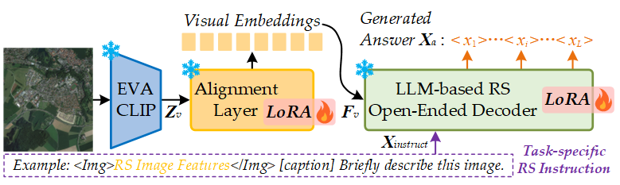
</div>

## 🌋 SkyEye-968k: Unified RS Vision-Language Instruction
The download link of the unified remote sensing vision-language instruction dataset is here! 🚀

Download link: https://huggingface.co/datasets/ZhanYang-nwpu/SkyEye-968k

<div align="center">
  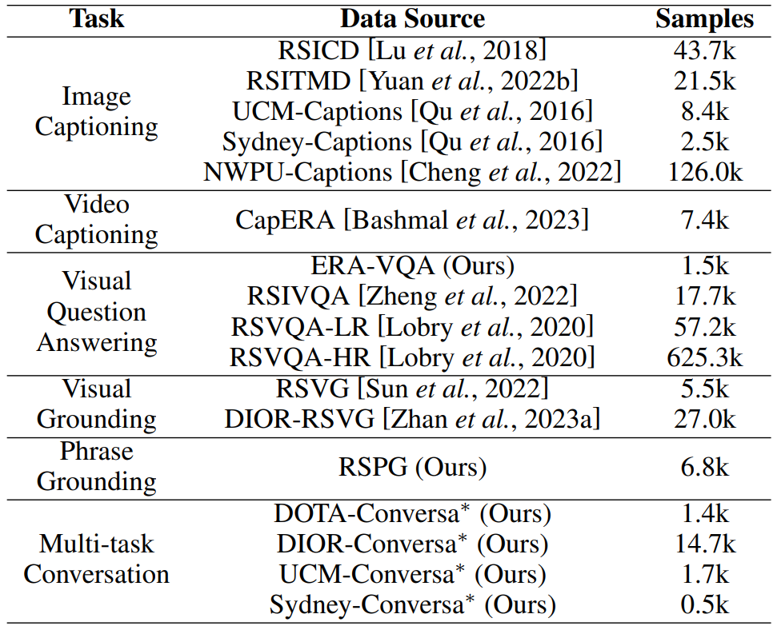
</div>


## 📦 Performance
<div align="center">
  
</div>

  

## 👁️ Visualization

### 1. Detailed description
<div align="center">
  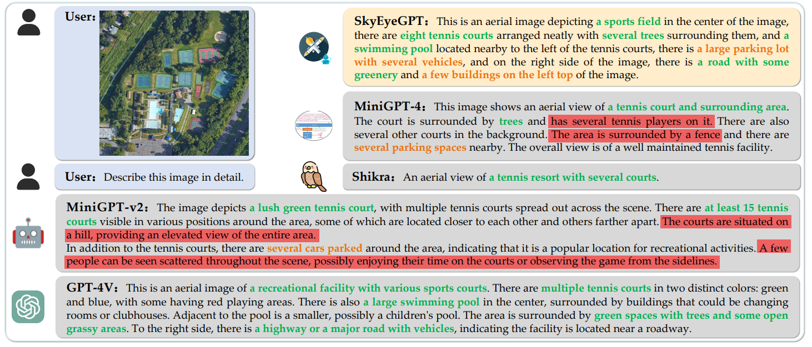
</div>

### 2. Some testing samples of captioning, grounding, and VQA
<div align="center">
  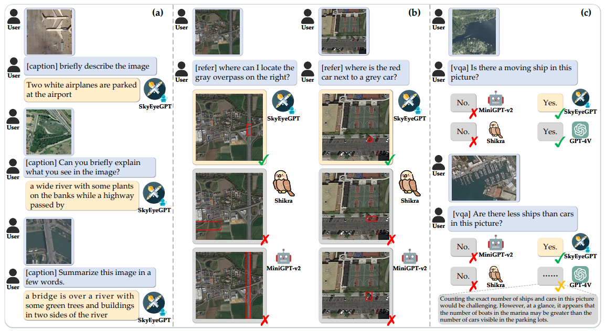
</div>

## 👁️ Qualitative results
### 1. Remote Sensing Visual Grounding
<div align="center">
  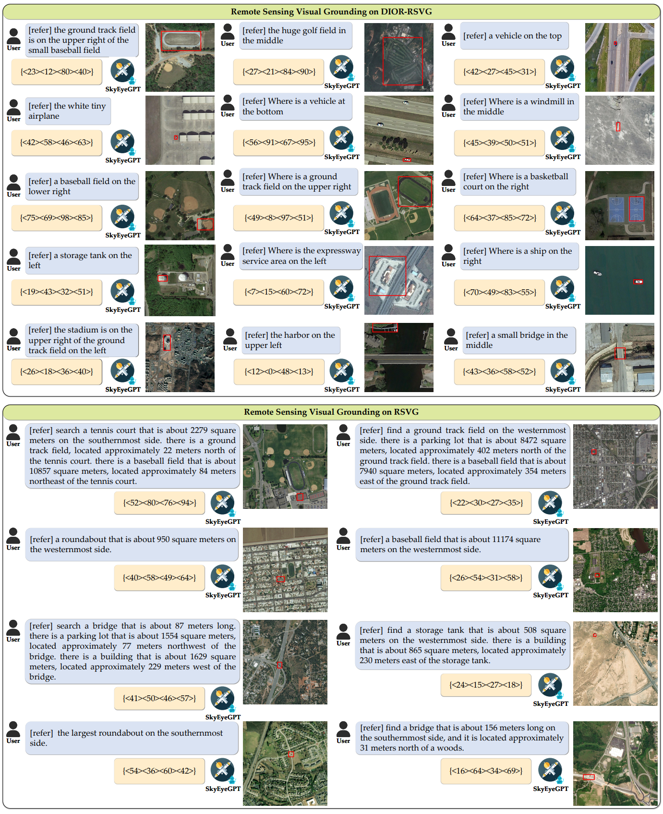
</div>

### 2. Remote Sensing Phrase Grounding
<div align="center">
  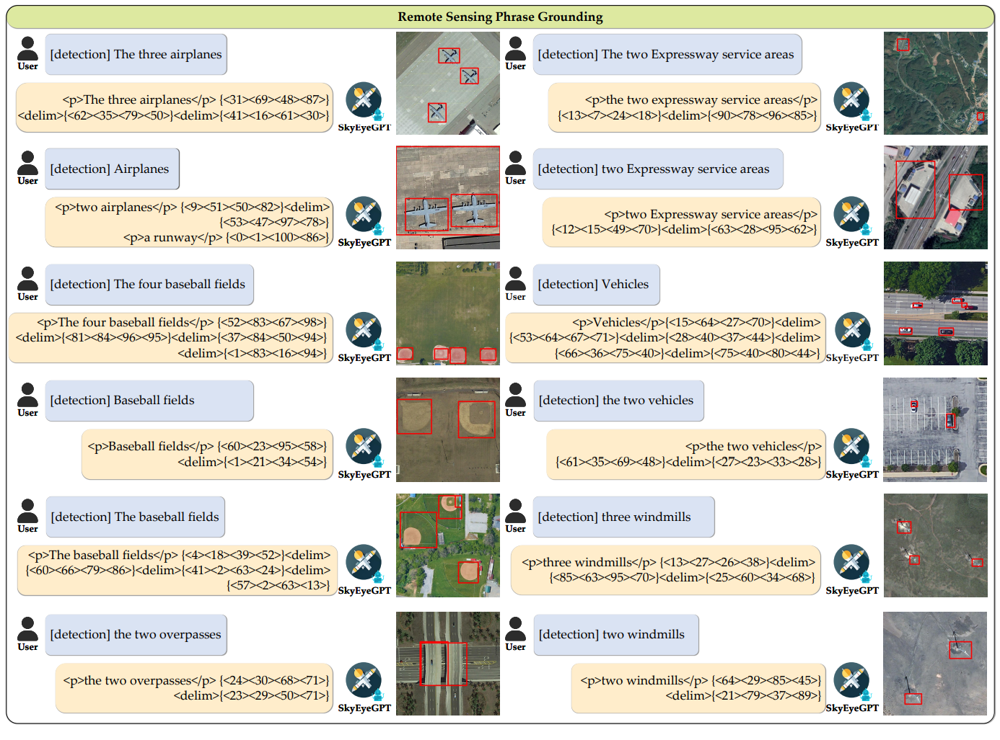
</div>

### 3. Remote Sensing Image Captioning
<div align="center">
  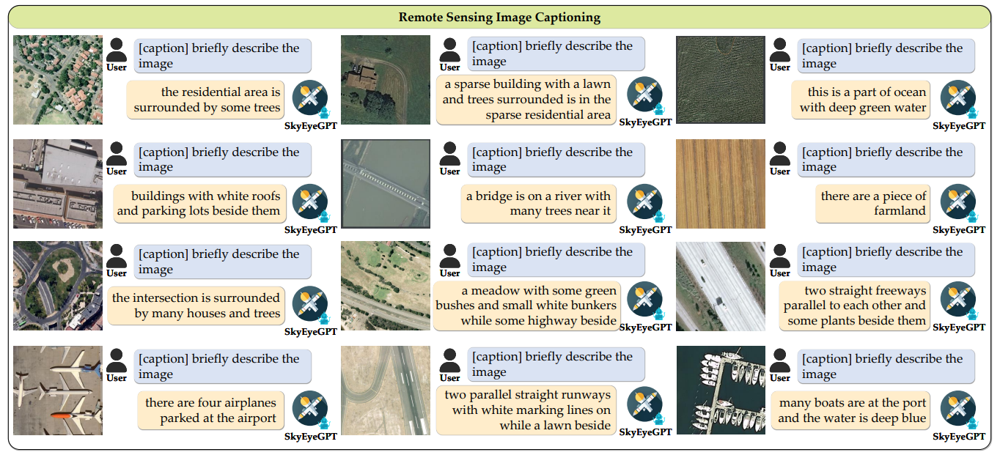
</div>


### 4. UAV Aerial Video Captioning
<div align="center">
  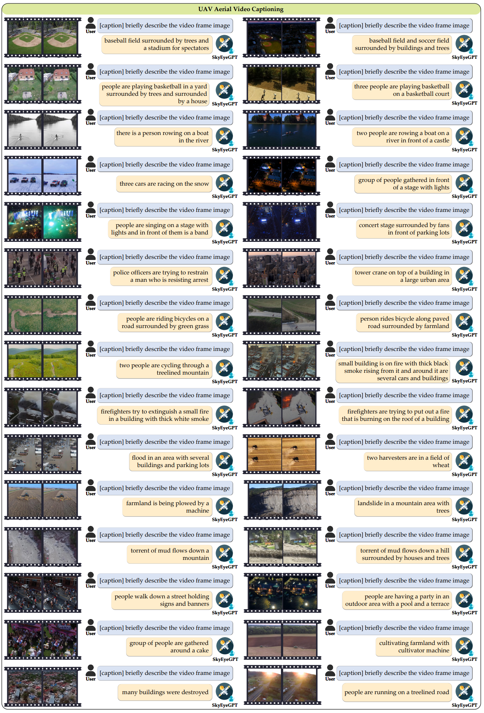
</div>


### 5. Remote Sensing Visual Question Answering
<div align="center">
  
</div>

### 6. Remote Sensing Referring Expression Generation 
<div align="center">
  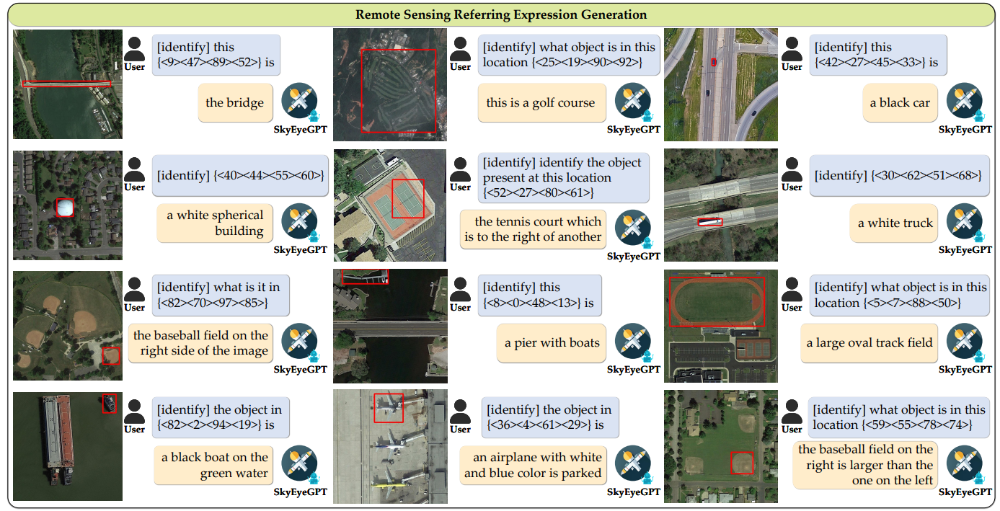
</div>

### 7. Remote Sensing Scene Classification
<div align="center">
  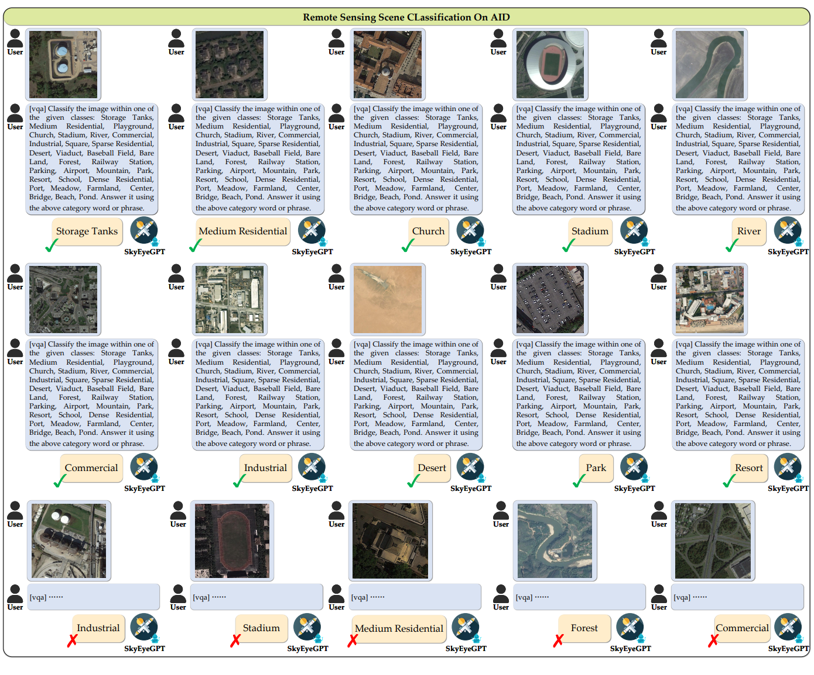
</div>


## 🔍 Quantitative results
### 1. Remote Sensing Image Captioning
<div align="center">
  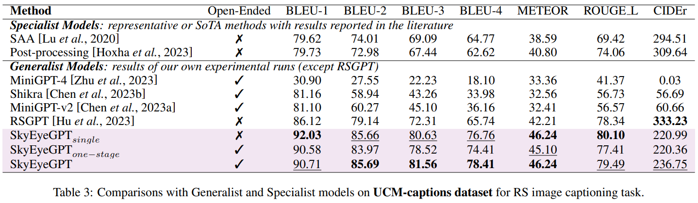
</div>
<div align="center">
  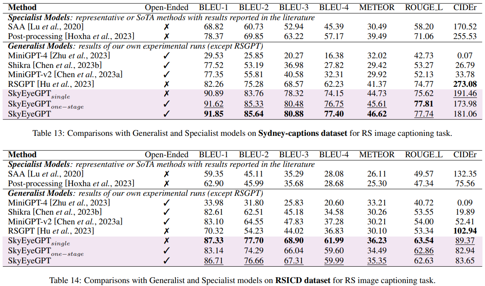
</div>

### 2. UAV Aerial Video Captioning
<div align="center">
  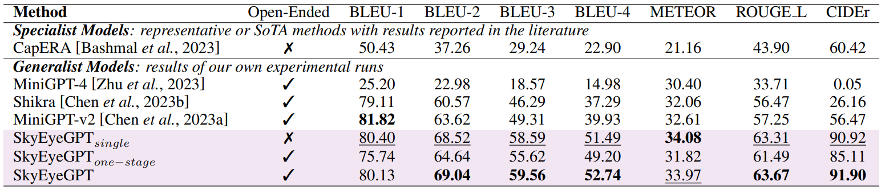
</div>

### 3. Remote Sensing Visual Grounding
<div align="center">
  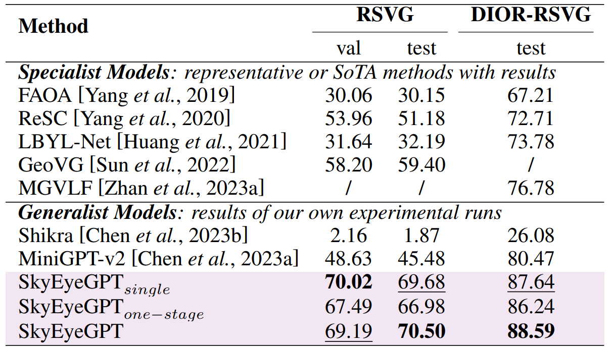
</div>

### 4. Remote Sensing Visual Question Answering
<div align="center">
  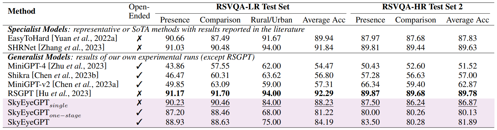
</div>
<div align="center">
  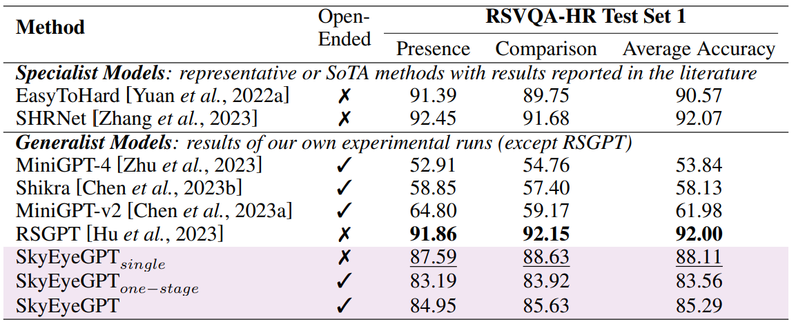
</div>


## 📜 Citation
```bibtex
@misc{zhan2024skyeyegpt,
      title={SkyEyeGPT: Unifying Remote Sensing Vision-Language Tasks via Instruction Tuning with Large Language Model}, 
      author={Yang Zhan and Zhitong Xiong and Yuan Yuan},
      year={2024},
      eprint={arXiv:2401.09712},
      archivePrefix={arXiv}
}
```


## 🙏 Acknowledgement
Our code is based on [MiniGPT-4](https://github.com/Vision-CAIR/MiniGPT-4), [shikra](https://github.com/shikras/shikra), and [MiniGPT-v2](https://github.com/Vision-CAIR/MiniGPT-4). We sincerely appreciate their contributions and authors for releasing source codes. We are thankful to EVA and LLaMA2 for releasing their models as open-source contributions. I would like to thank Xiong zhitong and Yuan yuan for helping the manuscript. I also thank the School of Artificial Intelligence, OPtics, and ElectroNics (iOPEN), Northwestern Polytechnical University for supporting this work.


## 🤖 Contact
If you have any questions about this project, please feel free to contact zhanyangnwpu@gmail.com.
